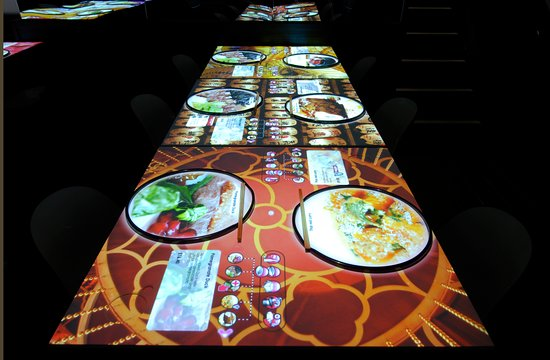

  
  <h1>CSE 108: Java Term Project (Part 1)</h1>
  <h2>Restaurant Database System</h2>

## 🍔 Overview

Welcome to the **Restaurant Database System**, a Java program designed to manage a delightful assortment of restaurants and their mouthwatering food menus. This interactive system allows you to perform various operations, from searching for restaurants and food items to adding new establishments and delectable dishes to the collection.

## 🌟 Key Features

The **Restaurant Database System** boasts a range of features, including:

- **Restaurant Management:** Maintain a collection of restaurants, each with unique attributes.
- **Food Item Catalog:** Keep track of food items on restaurant menus with relevant details.
- **Search and Discover:** Search for restaurants and food items based on multiple criteria.
- **Data Persistence:** Automatically load and save data from and to text files.
- **Visual Reports:** Generate statistics and insights about the restaurants and food items.

## 🚀 Getting Started

To run this enchanting program:

1. Ensure you have the Java Development Kit (JDK) installed.
2. Compile the program: `javac RestaurantApp.java`
3. Start the magic: `java RestaurantApp`

## 🌮 Main Menu Magic

Experience the wonder of the **Main Menu**:

Main Menu:

1. Search Restaurants
2. Search Food Items
3. Add Restaurant
4. Add Food Item to the Menu
5. Exit System

## 🍽️ Option (1) - Search Restaurants

Discover restaurants using a variety of criteria, including Name, Score, Category, Price, and Zip Code.

## 🍕 Option (2) - Search Food Items

Uncover delightful food items on menus based on Name, Category, Price Range, and more.

## 🏢 Option (3) - Add Restaurant

Enchant the database with new restaurants. Provide all required information, including up to three enchanting categories.

## 🍟 Option (4) - Add Food Item to the Menu

Add magical food items to a restaurant's menu. Ensure the chosen restaurant exists before adding the delight.

## ✨ Option (5) - Exit System

Bid farewell to the magic, and let your data be saved automatically.

## 📦 Input Files

Load the magic of your data from `restaurant.txt` and `menu.txt`. Both files use a comma-separated format.

## 🎩 Assumptions and Enchantments

Embrace these enchantments during your magical journey:

- No hardcoding allowed.
- Design code for reusability.
- All restaurant names are unique.
- Food items are unique on restaurant menus.
- No limits on restaurants or food items.
- Searches are case-insensitive.
- Data file formats are correct; no validation needed.
- Command-line interface only; no JavaFX or Swing.

## 💸 Price Symbols 

The mystical price symbols indicate cost per person for an average meal.

## 🌟 Now, Begin Your Journey

Explore the enchanted world of restaurants and food items with the **Restaurant Database System**. Let the magic unfold!

---
**Note**: This document is a mere enchantment and provides a glimpse into the project's fantastical world. Actual program behavior and implementation may carry their own unique enchantments. Detailed coding and functionality should be developed in accordance with the magical project specifications and requirements.
